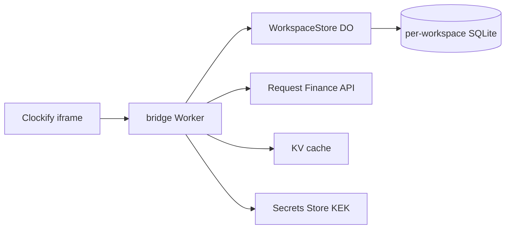

[](https://codecov.io/github/Quantumlyyy/clockify-rf-bridge)

# Clockify ↔ Request Finance Bridge

A Clockify add-on that turns a saved Clockify invoice into a Request Finance USDC crypto invoice and writes the payment link back into the Clockify invoice note.

> **Legal:** This repository is public for transparency and review. It is **not** open-source software. All rights reserved — see [NOTICE](NOTICE).

## Who is this for?

Teams that use **Clockify** for invoicing and **Request Finance** for crypto payments, and want a self-hosted bridge between the two without manual copy-paste.

## How it works

1. Someone opens an invoice in Clockify and clicks the add-on action.
2. The bridge reads the invoice from Clockify, exports the PDF, and creates a matching RF invoice.
3. RF issues the invoice and returns a payment link.
4. The bridge appends that link to the Clockify invoice note.

Each Clockify workspace gets its own isolated storage (a Cloudflare Durable Object), so tokens and invoice mappings never leak across workspaces.



## Prerequisites

- Node.js 22+
- [pnpm](https://pnpm.io/) 11+
- [Wrangler](https://developers.cloudflare.com/workers/wrangler/) 4+
- A Clockify add-on key and a Request Finance API key for testing

## Quick start (local)

```bash
git clone https://github.com/Quantumlyyy/clockify-rf-bridge.git
cd clockify-rf-bridge
pnpm install

cp .dev.vars.example apps/bridge/.dev.vars
# Edit apps/bridge/.dev.vars — set ADDON_KEY and RF_KEK (see file comments)

pnpm gen
pnpm dev
```

Local manifest URL: `http://localhost:5173/manifest`

Point your Clockify add-on manifest at that URL while developing.

## Configuration

| Variable               | Where                                       | Purpose                                          |
| ---------------------- | ------------------------------------------- | ------------------------------------------------ |
| `ADDON_KEY`            | `.dev.vars` / wrangler `vars`               | Clockify add-on identifier (JWT `sub` check)     |
| `RF_KEK`               | `.dev.vars` (local) or Secrets Store (prod) | 32-byte hex key for encrypting stored API tokens |
| `RF_CLIENT_MAPPING_UI` | wrangler `vars`                             | Set `true` to show RF client picker in settings  |

Clockify install tokens and RF API keys are entered through the add-on UI and stored encrypted in the workspace Durable Object — not in environment variables.

## Deploy to Cloudflare

[`apps/bridge/wrangler.jsonc`](apps/bridge/wrangler.jsonc) is wired to Quantumly's Cloudflare account (KV, Secrets Store, `ADDON_KEY`). For your own deployment, start from [`apps/bridge/wrangler.jsonc.example`](apps/bridge/wrangler.jsonc.example) instead:

1. Create a KV namespace: `wrangler kv namespace create cache`
2. Create a Secrets Store and add `RF_KEK` (64-char hex from `openssl rand -hex 32`)
3. Paste those ids and your Clockify `ADDON_KEY` into wrangler config
4. Build and deploy:

```bash
pnpm build
wrangler deploy --config apps/bridge/wrangler.jsonc
```

The worker entry is [`apps/bridge/src/worker.ts`](apps/bridge/src/worker.ts). It re-exports the SvelteKit handler and the `WorkspaceStore` Durable Object class.

## Workspace storage

All per-workspace data lives in a `WorkspaceStore` Durable Object (keyed by Clockify workspace id):

| Table               | What it stores                                                 |
| ------------------- | -------------------------------------------------------------- |
| `encrypted_secrets` | Clockify install token and RF API token (encrypted)            |
| `invoice_mappings`  | Completed Clockify invoice → RF payment link (idempotency)     |
| `invoice_runs`      | In-flight orchestration state for resume after partial failure |
| `client_mappings`   | Optional Clockify client → RF client mapping                   |

Schema: [`packages/db/src/schema.ts`](packages/db/src/schema.ts). Migrations run automatically inside each DO on first access.

### Migrating from D1 (legacy)

If you still have data in the old D1 `persistence` database:

1. Export `encrypted_secrets` and `invoice_mappings` grouped by `workspace_id`.
2. For each workspace, seed the `WorkspaceStore` DO via its `/token` and `/mapping` RPC routes.
3. Remove the D1 binding once verified.

Fresh local installs can skip this entirely.

## Development

| Command            | What it does                                 |
| ------------------ | -------------------------------------------- |
| `pnpm dev`         | Start the bridge dev server                  |
| `pnpm build`       | Build all packages and the bridge app        |
| `pnpm test`        | Run tests in all workspaces                  |
| `pnpm lint`        | Check formatting (oxfmt), oxlint, and ESLint |
| `pnpm check`       | SvelteKit type-check                         |
| `pnpm format`      | Auto-format with oxfmt                       |
| `pnpm gen`         | Regenerate Wrangler types                    |
| `pnpm db:generate` | Generate a new DO SQLite migration           |

See [CONTRIBUTING.md](CONTRIBUTING.md) for more detail on running and reviewing the code.

## Project structure

```
apps/bridge/                    SvelteKit + Cloudflare Workers app
packages/request-finance/       RF HTTP client + Effect Schema types
packages/db/                    Drizzle schema + DO SQLite migrations
packages/workspace-store/       Per-workspace Durable Object + RPC client
packages/invoice-core/          Invoice orchestration state machine
```

Package boundaries:

- **`@clockify-rf-bridge/request-finance`** — rnf_invoice schemas and typed HTTP only.
- **`@clockify-rf-bridge/invoice-core`** — orchestration logic; Clockify client injected from bridge.
- **`@clockify-rf-bridge/workspace-store`** — DO actor and fetch-based RPC used by bridge routes.

## Dev notes

Internal research notes live in [`docs/spikes/`](docs/spikes/). They document decisions made during development, not end-user setup.

## Security

Report vulnerabilities privately — see [SECURITY.md](SECURITY.md).
